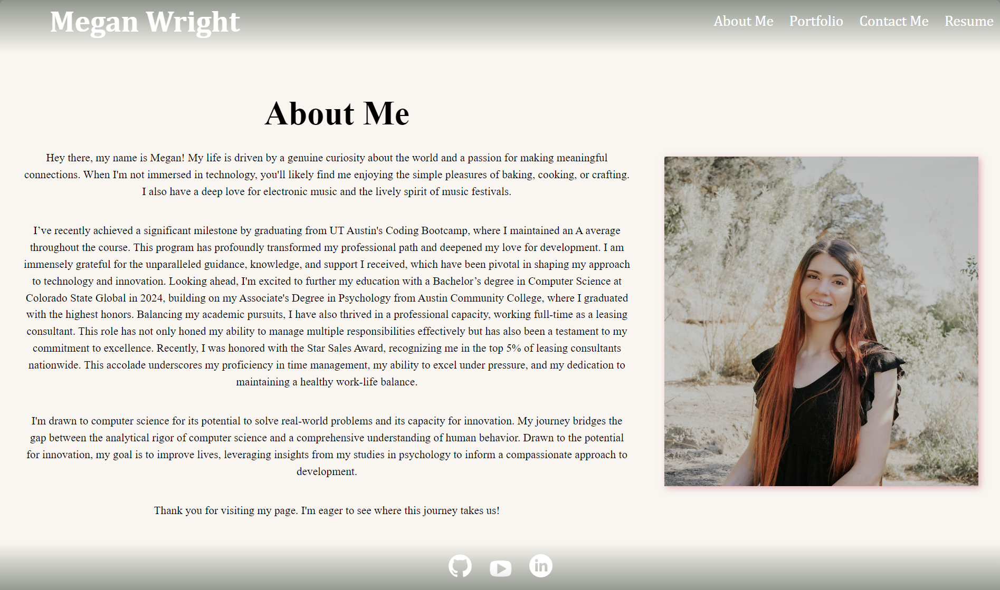
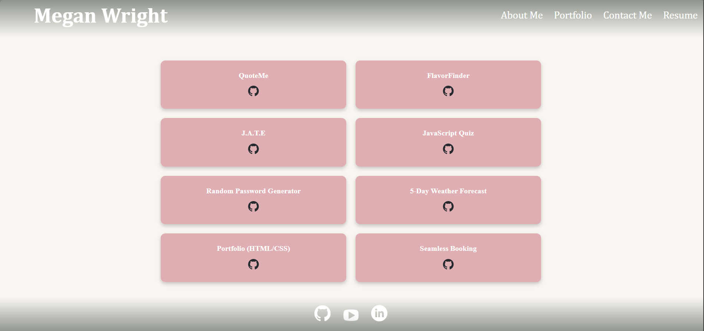

# Project Title

## Description

Welcome to my personal portfolio application, a digital gateway to my professional and personal world. This application is designed with the intent to provide a comprehensive and engaging overview of who I am, what I do, and what I am passionate about. It's not just a showcase of my skills and achievements but also a reflection of my journey and personality.

### Application Overview:
Type of Application: This is a Single Page Application (SPA) that offers a seamless user experience. The SPA format allows for quick and dynamic interaction without the need for page reloads, providing an intuitive and fluid navigation experience.

### Key Features:

- About Me Page: Delve into my story — from my professional journey to personal interests. This section encapsulates my experiences, highlighting my passion for technology and continuous learning.

- Portfolio Section: A curated collection of my projects and achievements. It showcases my technical skills through various completed works, ranging from web development projects to creative endeavors.

- Responsive Design: Built to adapt across a multitude of devices, the application ensures a consistent and engaging user experience whether accessed on a desktop, tablet, or mobile phone.

- Interactive UI Elements: The application features interactive and dynamic user interface elements, enhancing user engagement and showcasing my flair for modern web design techniques.

- Contact Information: Provides easy access to my professional contact details and social media, facilitating straightforward communication for potential employers, collaborators, or anyone interested in my work. **Due to no active back-end currently, submissions here will not be sent/delivered**

### Technologies Used:
- Front-End Development: Crafted with React.js, this application leverages the power and flexibility of this popular JavaScript library, known for its efficient rendering and state management capabilities.

- Styling and Layout: Utilizes CSS3 and Flexbox for responsive design, ensuring the application is aesthetically pleasing and functional across all device sizes.

- Routing: Employs React Router for seamless navigation within the SPA, enhancing the user experience by mimicking a multi-page site's navigational structure.

- Deployment and Hosting: Hosted on Netlify, the application benefits from reliable uptime and fast content delivery.

This portfolio application is more than just a showcase; it's a reflection of my dedication to quality, attention to detail, and my journey in the ever-evolving field of technology.

## Screenshots

### Home Page

### About Me

### Portfolio

### Contact Me

### Resume

## Deployed Application

[Click here to visit the site](link-to-your-deployed-page)

## Acknowledgements

A heartfelt thank you to the educators and fellow developers whose guidance and collaboration were invaluable in the extension of this project ♡

